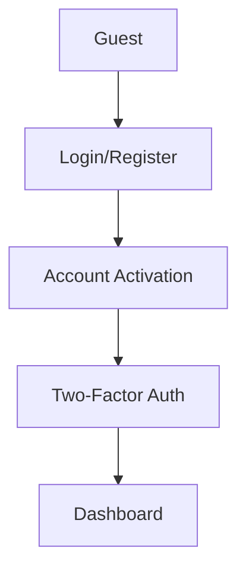

# Authentication Security Architecture

## Current Implementation

### Flow Diagram


### Key Components
1. **Route Security**:
```php
// routes/web.php
Route::middleware(['auth', 'verified']) // Core auth
  ->middleware('throttle:5,1') // Brute-force protection
  ->middleware('signed') // URL validation
```

2. **User Model** (`app/Models/User.php`):
- `activated_at` timestamp
- `two_factor_enabled` flag
- Hidden sensitive fields: `password`, `remember_token`

3. **Security Middleware**:
- `PreventBackHistory`: Browser cache control
- `VerifyCsrfToken`: Form submission protection
- `EncryptCookies`: Data confidentiality

## Recommended Improvements

### 1. Enhanced Rate Limiting
```diff
// routes/web.php
Route::post('/activate/{user}', [ActivationController::class, 'store'])
+    ->middleware('throttle:3,15'); // 3 attempts per 15 minutes
```

### 2. Two-Factor Auth Isolation
```php
// Create new middleware group
Route::middleware(['auth', 'twofactor'])
   ->prefix('two-factor')
   ->group(function () {
       // 2FA routes
   });
```

### 3. Session Security
```php
// config/session.php
'secure' => env('SESSION_SECURE_COOKIE', true),
'http_only' => true,
'same_site' => 'strict',
```

### 4. Activation Process
```php
// app/Http/Controllers/Auth/ActivationController.php
const ACTIVATION_EXPIRES = 60; // Minutes

public function activate(User $user)
{
    if ($user->created_at->diffInMinutes() > self::ACTIVATION_EXPIRES) {
        abort(410, 'Activation link expired');
    }
}
```

## Architectural Decisions

1. **Separation of Concerns**:
- Activation vs Authentication flows
- Dedicated middleware for security controls

2. **Defense in Depth**:
- Layered verification (email, 2FA)
- Multiple rate limiting strategies

3. **Secure Defaults**:
- Signed URLs for sensitive operations
- CSRF protection on all forms
